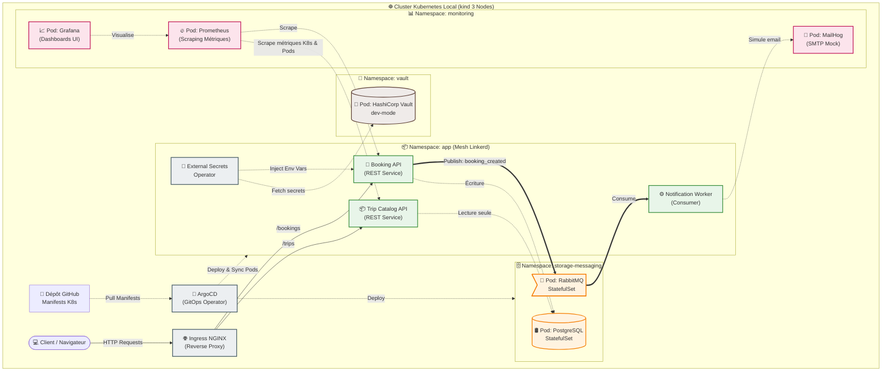

# Micro-Trips — GitOps & Cloud-Native Infrastructure

Ce dépôt centralise l'**état désiré** et la configuration déclarative complète de l'infrastructure de production **Micro-Trips** (version Local-First). En s'appuyant sur le modèle **GitOps**, toute modification apportée à ce dépôt est automatiquement réconciliée sur notre cluster Kubernetes local (`kind`).

L'intelligence métier (le code source des microservices en Go) est quant à elle hébergée sur le dépôt applicatif : `micro-trips-infra`.

---

## 📐 Diagramme de l'Architecture Global

Le schéma ci-dessous détaille l'intégralité du cluster multi-noeuds, le routage des flux, le maillage réseau, l'isolation des espaces de noms (*namespaces*) et la tuyauterie de gestion des secrets :



---

## Structure Détaillée du Dépôt (Pattern Application-of-Applications)

L'organisation des fichiers utilise la puissance de **Kustomize** pour factoriser le code et gérer proprement la séparation entre les configurations de base (*base*) et les configurations spécifiques locales (*overlays*) :

```text
.
├── apps/                         # Configuration des Microservices métiers
│   ├── booking/                  # Manifests Kustomize (Deployments, Services, Rollouts)
│   ├── catalog/                  # Configuration du service Trip Catalog
│   └── worker/                   # Configuration du Notification Worker
├── bootstrap/                    # Point d'entrée de l'automatisation GitOps
│   ├── root-app.yaml             # Application racine ArgoCD (Pattern App-of-Apps)
├── manifests/                    # Opérateurs, Outillage Cloud-Native & Stockage
│   ├── ingress-nginx/            # Contrôleur d'Ingress pour le routage
│   ├── linkerd/                  # Maillage de services (Service Mesh)
│   ├── external-secrets/         # Synchronisation dynamique des secrets Vault
│   ├── sealed-secrets/           # Contrôleur Bitnami pour décoder les secrets chiffrés Git
│   ├── prometheus-stack/         # Stack Prometheus / Grafana (Télémétrie)
│   ├── kubecost/                 # Module de monitoring FinOps des coûts
│   ├── postgresql/               # Déploiement des bases de données isolées (Bitnami Charts)
│   └── rabbitmq/                 # Déploiement du broker de messages AMQP (Bitnami Charts)
├── docs/                         # Documentation et livrables académiques
│   ├── captures/                 # Screenshots exigés (ArgoCD synced, Grafana, Kubecost)
│   ├── ADR.md                    # Architecture Decision Records (5 choix clés)
│   ├── RAPPORT_TECHNIQUE.md      # Rapport complet d'ingénierie (8-15 pages)
│   └── architecture.png          # Export visuel du diagramme de flux
├── SETUP.md                      # Guide de réplication pas à pas (< 30 min)
└── README.md                     # Cette vitrine d'accueil

```

---

## Le Cycle CI/CD & Pipeline GitOps Automatisée

Le projet implémente une boucle de déploiement continu moderne et découplée entre l'intégration du code et le déploiement sur le cluster :

```
[ Code Push ] ➔ 🛠️ CI (GitHub Actions) ➔ 🐳 Docker Build & Push ➔ 📝 Écriture automatique du Tag sur GitOps ➔ 🐙 ArgoCD Sync ➔ ☸️ Kind Cluster

```

1. **Intégration Continue (CI - Dépôt Applicatif) :** Lorsqu'un développeur pousse du code sur le dépôt `micro-trips`, une pipeline GitHub Actions se déclenche : elle exécute les tests unitaires, vérifie la syntaxe Go et compile les images de conteneurs de manière sécurisée via un *Multi-Stage Build*.
2. **Publication & Docker Secrets :** Les images Docker validées sont poussées sur notre registre privé (Docker Hub ou GitHub Packages). Pour permettre à notre cluster `kind` local de télécharger ces images sans exposer nos identifiants en clair, un **Docker Secret de type `kubernetes.io/dockerconfigjson**` est généré, chiffré via `kubeseal`, et stocké de manière sécurisée dans notre dépôt sous la forme d'un objet `SealedSecret`.
3. **Mise à jour GitOps (CD) :** En fin de pipeline, un script met à jour automatiquement le fichier `kustomization.yaml` du dossier `config/apps/overlays/local/` avec le nouveau tag de l'image (SHA du commit).
4. **Réconciliation ArgoCD :** ArgoCD détecte instantanément la modification sur ce dépôt GitOps, constate la dérive de l'état du cluster, et déclenche un déploiement progressif de type **Canary via Argo Rollouts**, validé automatiquement par des requêtes de métriques PromQL.

---

## Stratégie de Gestion des Secrets (Double Protection)

Notre approche d'architecture applique les principes du framework de sécurité *Zero-Trust* à l'aide de deux outils complémentaires :

### 1. Secrets Statiques d'Amorçage via Bitnami Sealed Secrets

* **Cible :** Jetons d'API (Token Kubecost) et identifiants de registres d'images (`imagePullSecrets` / Docker Secrets).
* **Mécanisme :** Chiffrés asymétriquement en local par l'administrateur avec la clé publique du cluster via l'outil `kubeseal`. Ils sont stockés en toute sécurité sur Git. Seul le contrôleur s'exécutant au sein du cluster possède la clé privée pour les décoder.

### 2. Secrets Dynamiques Applicatifs via HashiCorp Vault & ESO

* **Cible :** Chaînes de connexion PostgreSQL, mots de passe utilisateurs et credentials RabbitMQ.
* **Mécanisme :** Stockés de manière centralisée dans **HashiCorp Vault** (mode dev sécurisé). L'**External Secrets Operator (ESO)** interroge l'API de Vault en tâche de fond et génère à la volée des objets `Secret` Kubernetes éphémères directement injectés dans la mémoire vive des conteneurs applicatifs.

---

## Observabilité, Télémétrie et Gestion des Coûts (FinOps)

L'infrastructure ne se contente pas de faire tourner du code ; elle s'auto-observe en permanence :

* **Linkerd Service Mesh :** Injecte un proxy sidecar Rust transparent à côté de chaque pod applicatif pour chiffrer le trafic interne via mTLS et remonter en direct les *Four Golden Signals* (Taux de succès, Latence, Débit).
* **Prometheus & Grafana Stack :** Scrapent les points de terminaison d'observabilité et affichent des dashboards graphiques détaillant la santé des applications et de la file d'attente RabbitMQ.
* **MailHog UI :** Fournit un serveur SMTP factice pour intercepter et prévisualiser graphiquement à l'écran les e-mails de notification envoyés par le worker, sans polluer de vraies boîtes mail.
* **Kubecost Monitoring :** Analyse en temps réel la consommation CPU/RAM de chaque namespace et la mappe avec les coûts réels des infrastructures cloud, permettant d'identifier le surdimensionnement fonctionnel et d'optimiser nos ressources Kubernetes.

---

## 🚀 Déploiement Rapide de l'Infrastructure (< 30 minutes)

*L'intégralité des prérequis de configuration et des commandes ordonnées est documentée de manière stricte dans le fichier dédié `SETUP.md`.*

Pour lancer l'amorçage de toute l'architecture en une seule commande grâce au pattern *Application of Applications* d'ArgoCD :

```bash
kubectl apply -k bootstrap/

```

ArgoCD va alors lire le manifeste racine, instancier les dépendances de stockage (Postgres, RabbitMQ), démarrer la pile de sécurité (Vault, ESO, Sealed Secrets), monter l'observabilité (Prometheus, Grafana, Kubecost) et enfin déployer les versions stables de nos microservices.

---

## 👤 Auteur & Versioning

* **Concepteur de l'infrastructure :** Ghostbusters-ace
* **Version du Tag Git soutenu :** `v1.0-soutenance`
* **Date de livraison :** Juillet 2026
